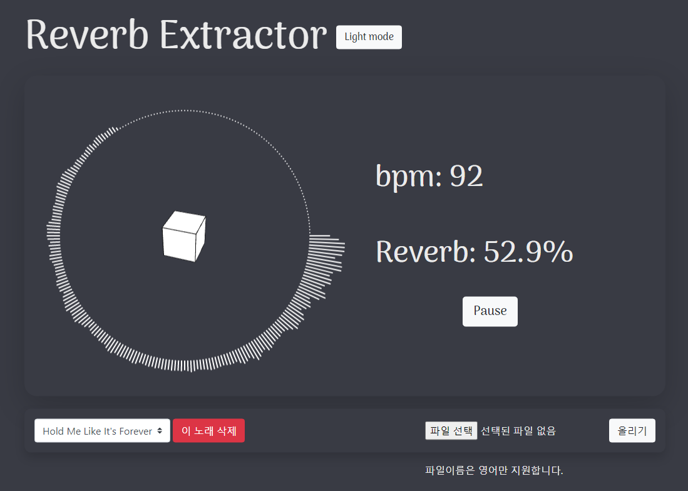

# Reverb Extractor

## 글로벌융합공학부 2020 Fall 상상설계 프로젝트

 

 

Reverb Extractor는 음악의 유사성을 다른 방식으로 측정해보자는 프로젝트에서 시작되었습니다.

내부적으로 MATLAB engine을 사용하여 주어진 mp3 file에서 bpm과 새로 정의한 reverb 수치를 얻어내고, HTML canvas를 통해 시각적으로 나타냅니다.

### Usage

- python3 manage.py run

### Used Stack

- HTML canvas with p5
- Flask backend API

### Requirements

- python3 (not tested on python2)
- MATLAB==R2020b
- matlabengineforpython==R2020b
- modules in requirements.txt
- works only on localhost or https

---

#### Not tested on other environments
